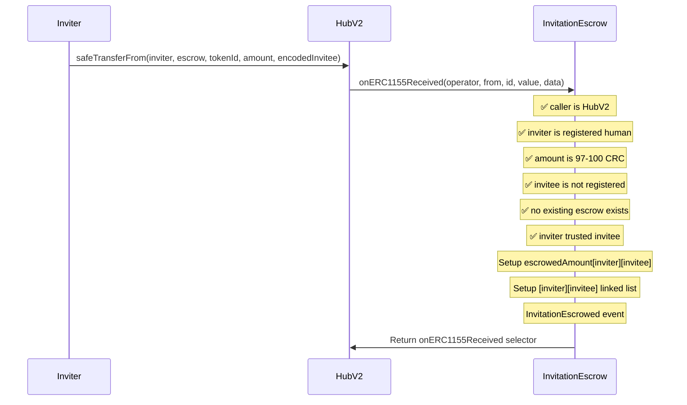
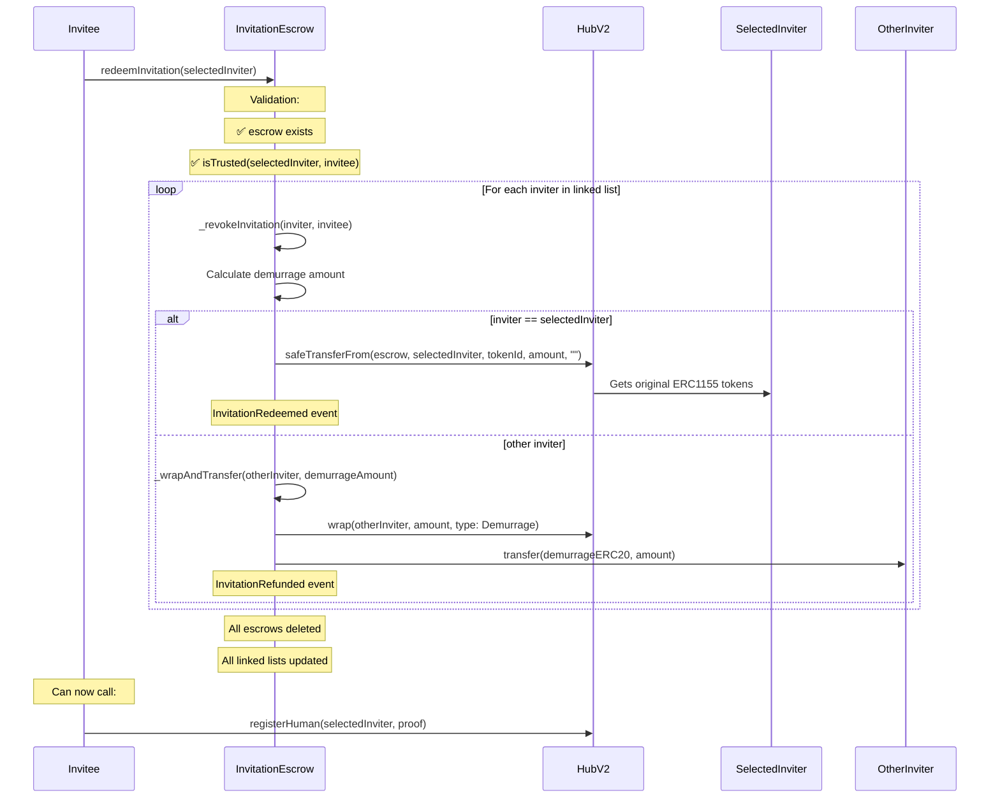
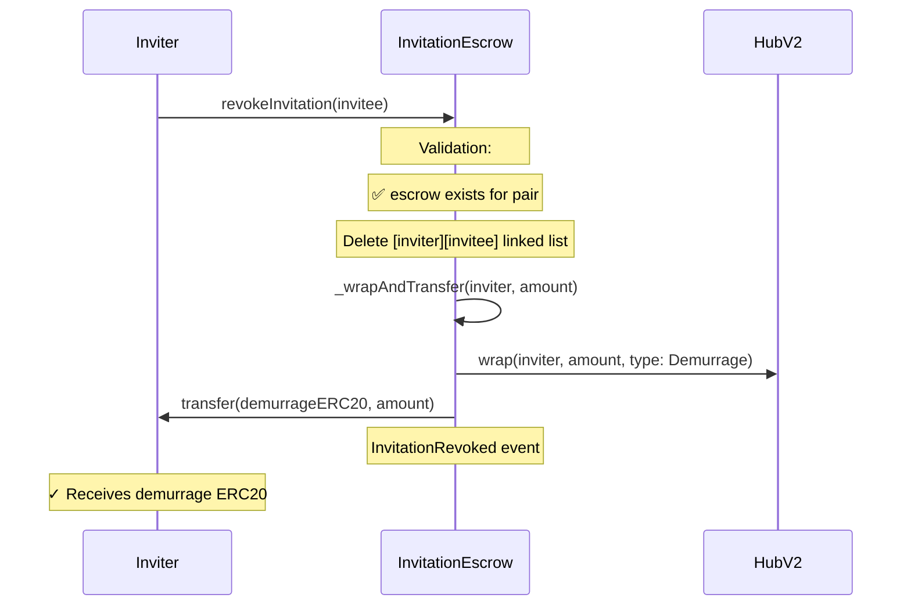
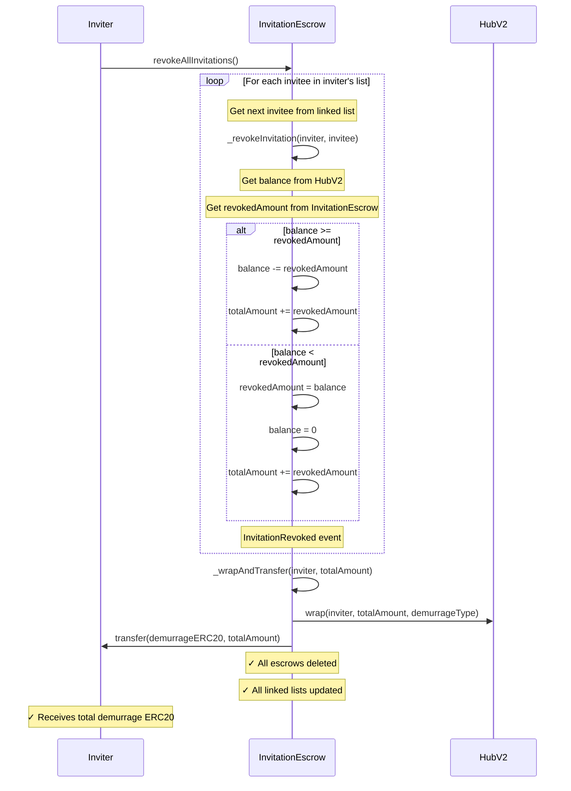

## Circles Invitation Escrow

Circles Invitation Escrow contract holds CRC for inviter that can later be redeemed by invitee to register as human.

## Dev

### Build

```shell
$ forge build
```

### Test

```shell
$ forge test
```

### Format

```shell
$ forge fmt
```

### Deploy

```shell
$ forge script script/InvitationEscrow.s.sol:InvitationEscrowScript --rpc-url $GNOSIS_RPC --private-key <your_private_key>
```

## How it works

The InvitationEscrow contract manages Circles (CRC) token invitations between registered humans (inviters) and unregistered users (invitees). It applies demurrage over time and handles invitation redemption and revocation.

### Core Concepts

- **Inviter**: Must be a registered human in HubV2 with CRC tokens
- **Invitee**: Must be unregistered (not yet human) to receive invitations
- **Escrow Amount**: Between 97-100 CRC tokens per invitation
- **Demurrage**: Token value decreases over time (Check Demurrage.sol)
- **Trust Requirement**: Inviter must first trust invitee for invitation to work

### Callflow

#### 1. Create Invitation

**Function**: `HubV2.safeTransferFrom(inviter, escrowContract, tokenId, amount, abi.encode(invitee))`  
**Function Caller**: Inviter

**Requirements**:

- Inviter must be registered human (`isHuman(inviter)`)
- Amount between `MIN_CRC_AMOUNT` (97 CRC) and `MAX_CRC_AMOUNT` (100 CRC)
- Invitee must not be registered (`avatars(invitee) == 0`)
- Trust must exist between inviter and invitee (`isTrusted(inviter, invitee)`)
- No existing escrow between this inviter-invitee pair

**Result**:

- CRC tokens locked in escrow contract
- Bidirectional linked list entries created (inviter→invitee and invitee→inviter)
- `InvitationEscrowed` event emitted
- Demurrage tracking begins



#### 2. Redeem Invitation

**Function**: `invitationEscrow.redeemInvitation(inviter)`  
**Function Caller**: Invitee

**Requirements**:

- Valid escrow must exist between inviter and invitee
- Trust must still be valid (`isTrusted(inviter, invitee)`)

**Result**:

- All invitations for the invitee are processed:
  - Selected inviter receives their original CRC tokens (ERC1155)
  - Other inviters receive demurrage ERC20 tokens as refunds
- All escrow records deleted and linked lists updated
- `InvitationRedeemed` event for selected inviter
- `InvitationRefunded` events for other inviters
- Invitee can now register as human using the CRC tokens by calling `HubV2.registerHuman(inviter)`



#### 3. Revoke Single Invitation

**Function**: `invitationEscrow.revokeInvitation(invitee)`  
**Function Caller**: Inviter

**Requirements**:

- Active escrow must exist between inviter and invitee

**Result**:

- Escrow deleted and linked list entries removed
- Inviter receives demurrage ERC20 token
- `InvitationRevoked` event emitted



#### 4. Revoke All Invitations

**Function**: `invitationEscrow.revokeAllInvitations()`  
**Function Caller**: Inviter

**Result**:

- All inviter's escrows are revoked
- Total demurrage ERC20 and transferred to inviter
- Individual `InvitationRevoked` events for each invitee



### View Functions

- `getInviters(invitee)`: Returns all active inviters for an invitee
- `getInvitees(inviter)`: Returns all active invitees for an inviter
- `getEscrowedAmountAndDays(inviter, invitee)`: Returns current demurrage-adjusted balance and days elapsed

### Edge Cases & Safeguards

1. **Balance Mismatches**: Hub balance may differ from escrow calculations.
   - **Solution**: Choose the smaller amount(`_capToHubBalance`).
2. **Trust Expiration**: Trust may expire between invitation and redemption
   - **Result**: `MissingOrExpiredTrust` error on redemption attempt
3. **Zero Balance After Demurrage**: Long-term escrows may decay to zero
   - **Result**: Unable to redeem invitation and requires new transfer.
